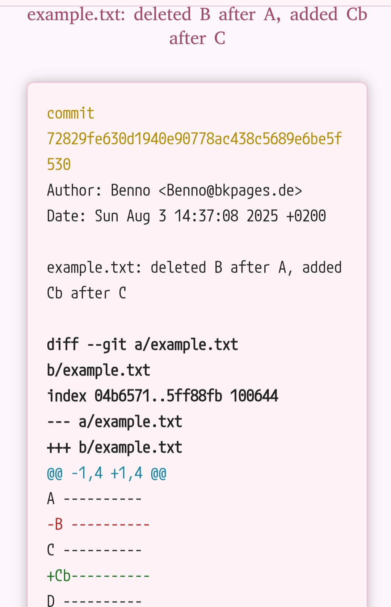

PRODUCT is a lightweight PHP script for browsing local git repositories via a web browser. It provides commit history, commit diffs (with color highlighting), and basic navigation, designed for self-hosting on a local or private server.

## Features

- **View commit history** of any repository in a directory.
- **See detailed diffs** for each commit, with colored highlights (additions, removals, metadata).
- **Theme-switching** (dark/light/etc.) via the UI.
- **Font-switching** (variety of fonts available) via the UI.
- **Navigation**: Click to move between the list of repositories, commit history, and single commit view.
- **Minimal dependencies**: Only requires PHP and read access to your git repositories.

## Usage

- **Repository List: (Level 1)** The landing page lists all git repositories under `$(REPODIR)` (default `/home/pi/gitrepos`).
- **Commit History: (Level 2)** Click a repository to see its commit history.
- **Commit Diff:**  (Level 3) Click a commit hash to see the full diff, color-coded.
- **Theme Switch:** Use the theme switcher (top right) to toggle between dark and light themes.
- **Navigation:** Use &#x25b2; to go up a level.
Use &#x25c0; and &#x25b6; to hop between commits in the commit-diff-view (level 3).

### Self-contained

PRODUCT is fully self-contained: it requires only a standard PHP installation and Git on the server (plus optional CSS for themes). There are no external dependencies or required PHP extensions beyond what is typically bundled with PHP itself. [^pandoc]

[^pandoc]: To change the README, the command **pandoc** must be available to convert the markdown to HTML. On debian or ubuntu this can be installed using `sudo apt install pandoc`. Without pandoc "make" will fail.

## Git Binary Selection

PRODUCT can use a special setuid copy of the `git` binary to avoid permission issues that often occur when the webserver runs as a different user than the owner of the repositories. 

- **If a setuid git binary (default `<your-repodir>/git4PRODUCT`) exists and is executable, PRODUCT will use it.**
- **If it does not exist, PRODUCT will fall back to the system git (`/usr/bin/git` or `git` in `$PATH`).**

> **Note:** In most real-world setups, a setuid git binary is required to allow the web server (often running as `www-data`) to access repositories owned by another user (e.g., `pi`). Without it, you may encounter permission errors or git refusing to operate due to "dubious ownership." For development or single-user installations where the web server and repositories share ownership, the system git may suffice.

The Makefile includes a target to build and install the setuid git binary with suitable ownership and permissions.

## Customizing for Your System

### Quick Start

In most cases, **the only variable you need to edit in the Makefile is `REPODIR`**, which defines where your Git repositories are stored.  
For example:
```makefile
REPODIR = /home/pi/gitrepos
```
Set this to the directory containing your repositories.

> **Tip:** Unless your web server uses a nonstandard document root, you do **not** need to change other settings.

### Web Server Root (PBINDIR)

By default, PRODUCT installs the PHP frontend and style assets to:
```makefile
PBINDIR = /data/www
```
If your server uses a different web root (e.g., `/var/www/html` for a standard Apache2 setup), change `PBINDIR` accordingly:
```makefile
PBINDIR = /var/www/html
```
Other related paths (like `PSTYDIR` for styles) are automatically set based on `PBINDIR`.

### Rebranding

You can easily rename the tool (including all scripts, CSS, and the setuid binary) by running:
```sh
make rebrand <new-name>
```
No manual renaming or file editing is required—everything is handled automatically.

---

**Summary:**  
- Only `REPODIR` must be edited for most setups.  
- Adjust `PBINDIR` only if your web root is not `/data/www`.  
- Use `make rebrand <new-name>` to change the tool’s name everywhere, without manual steps.
## Installation

1. **Clone or download this repository.**
2. **cloned setuid git binary** (recommended for multi-user or production setups):
   - The Makefile can create `<your-repodir>/git4PRODUCT` as a copy of `/usr/bin/git`, owned by `pi:www-data` with mode `4610`.
   - Adjust the `REPODIR`, `XTRGOWN`, `XTRGGRP`, `XTRGSRC`, and `XTARGET` variables in the Makefile if your paths or users differ.
3. Run make to get everything to where it belongs
   - for a **production environment** where you **do** need a setuid-clone.
   ```
   make
   ```
   - for a **dev/test environment** where you **do not** need a setuid-clone use
   ```
   make devinstall
   ```
   This copies `PRODUCT.php` and associated CSS to `/data/www` (edit `PBINDIR`/`PSTYDIR` as needed).
4. **Point your web browser to** `http://yourserver/PRODUCT.php`.
5. When the git-binary on your system
    - has been updated on your system or 
    - even when you doubt it could have been updated
    - then just use
   ```
   make
   ```
   again, as it will re-create the setuid-copy only
   if the original binary was updated.[^paranoid]

[^paranoid]:If you're paranoid to have an updated setuid-copy whenever the is a new git-bin, you could set up a cronjob running `make suidbin` as frequent as you wish.

## Security Notes

- This tool is intended for use on local or trusted networks only.
- The setuid git binary is a potential security risk if misconfigured. Make sure only trusted users have access to the web server and repository directories.

## Want to see a demo?

Just visit [https://bkpages.de/GitPeekDemo.php](https://bkpages.de/GitPeekDemo.php).
It will show 
(a copy of) my local repos (including the one you
are just viewing) that 
were pushed to github.

## The font selector

Implementing the font selector was interesting. Here
is what learned.
	
### About fonts on the web

If you want the font to be working, when you are completely **off**-net you should choose a **local** font!

**Local** fonts are **serif**, **sans-serif** and **monospace**.
If off-net, all other fonts will look the same, as a fallback kicks in.

### Background and Details

While developing this app, I noticed that very few fonts are available across all platforms. So-called “web-safe” fonts only work reliably on some desktop systems, and are rarely available on mobile devices. To solve this common web development issue, I use network-based fonts (like Google Fonts) for broader compatibility. That is really a great help. But I had to decide carefully, which font service I implement, as some services track the users (even across sites and apps).

I assume, the average user does not like to be tracked. So I chose bunny fonts from bunny.net (see here), as they are
- free to use
- open-source
- privacy-first
- zero-tracking
- no-logging policy
- hosted on a global CDN

which I decided, is good. So I implemented it.

---

## Appendix: Understanding Colored Git Diff Output

PRODUCT displays git diffs with color highlights for clarity, closely matching standard `git diff` output. Here’s what you may see:

### Diff Output Components

- **Commit Information**  
  - `commit <hash>`, `Author:`, `Date:`: Shown at the top of a commit.
  - Displayed in yellow.

- **Diff Headers**  
  - `diff --git a/file b/file`: Indicates which files are being compared.
  - `index <hash>..<hash> <mode>`: Shows file hashes and mode.
  - `--- a/file`, `+++ b/file`: Old and new filenames.
  - `@@ ... @@`: "Hunk" header, shows line numbers for the change.
  - All of these are shown in yellow.

- **File Changes**
  - Lines starting with `+` (plus): **Added lines**, highlighted in green.
  - Lines starting with `-` (minus): **Removed lines**, highlighted in red.
  - Lines starting with a space: Unchanged context, default color.
  - Lines starting with `\`: Meta lines (e.g., `\ No newline at end of file`), usually yellow.

- **Other Special Lines**
  - Lines with file permission changes, new file or deleted file messages, or mode changes, are typically shown in yellow.
  - Bold may be used for emphasis (e.g., commit ID).

### Example diff output

Example content before edit / commit:
```
A ----------
B ----------
C ----------
D ----------
```

Example content after edit / commit:
```
A ----------
C ----------
Cb----------
D ----------
```
results in[^screenshot]


[^screenshot]:as displayed on smartphone

#### Color Key

- **Yellow:** Commit info, hunk headers, file headers, meta lines.
- **Green:** Lines starting with `+` (additions).
- **Red:** Lines starting with `-` (removals).
- **Default:** All other lines (context).

### Notes

- The coloring is handled by PRODUCT’s CSS and PHP, using `<span>` tags for semantic highlighting.
- This makes it easier to read and understand changes at a glance, especially on larger diffs.
- Only the main content of the `git diff` is shown; binary files and non-text changes may appear as messages (yellow).

---

## License and author

This software was created and designed by
Himbeertoni.
Email: Toni.Himbeer@fn.de
Github: https://www.github.com/himbeer-toni

I made extensive use of GitHub Copilot while developing this project. Copilot proved to be incredibly helpful, saving me significant time and enabling me to implement far more features than I could have on my own. It allowed me to easily enhance both the appearance and functionality of the project without requiring extensive manual coding.

This project is licensed under the GNU General Public License v3.0 (GPLv3).

**What does this mean?**  
- You are free to use, study, modify, and share this software.
- If you distribute modified versions, you must also provide the source code and keep them under the same GPLv3 license.
- This ensures that all users have the same freedoms with the software.

For full details, please see the [official GPL v3 license text](https://www.gnu.org/licenses/gpl-3.0.html).

©2025 Himbeertoni

